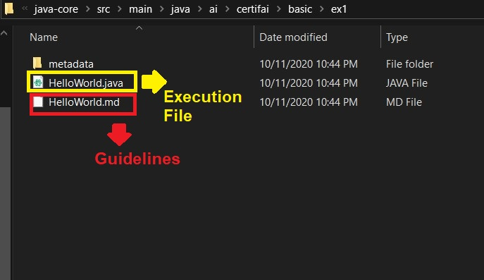
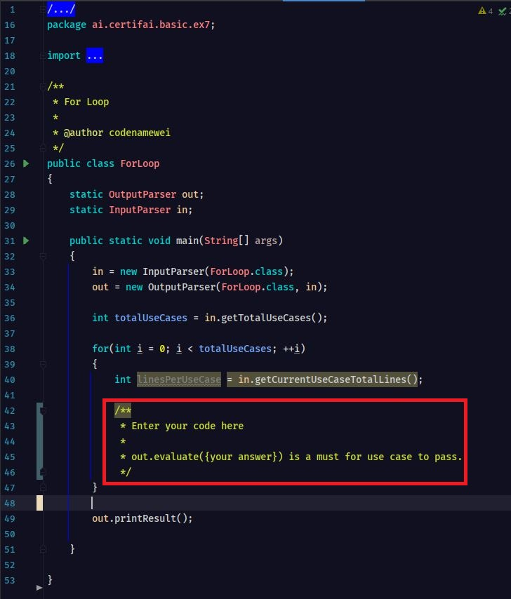
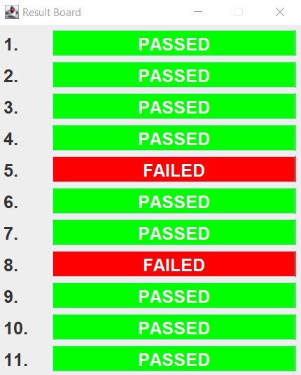

  

 

## What You Will Learn
- Through the building blocks of Java snippets, you will able to understand the gist of Java programming in no time.

## What You Need 
- Grit to go through the repository!
- [Oracle JDK 1.8](https://www.oracle.com/java/technologies/javase/javase-jdk8-downloads.html) or alternative open source JDK 1.8 version
  - As of today, the repository was tested with 
    - Oracle JDK 1.8
    - OpenJDK 1.8 
    - BellSoft Liberica JDK 1.8
- [Apache Maven 3.5](https://maven.apache.org/download.cgi) or later
- [Intellij IDE](https://www.jetbrains.com/idea/download/)  

**Takeaway:**\  
- Java - Programming Language
- Apache Maven - Java Dependency Manager
- 

## Repository Structure

- [**Basic**](https://github.com/CertifaiAI/learn-java-the-certifai-way/tree/master/java-core/src/main/java/ai/certifai/basic)
- [**Introduction to Apache Maven**](https://github.com/CertifaiAI/learn-java-the-certifai-way/tree/master/java-core/src/main/java/ai/certifai/maven)
- [**Intermediate**](https://github.com/CertifaiAI/learn-java-the-certifai-way/tree/master/java-core/src/main/java/ai/certifai/intermediate)

In order to gain the most benefits, choose the topic to look deeper into at your own pace.  

If starting from scratch, walkthrough the folder in the above order to gain the maximum learning experience. 

## How to Use This Repository

- Guides in the form of markdown in each ex* folder will shows what to do in the particular exercise.

  

 

- Only modify program code in the designated area in each exercise. \
Markdown in each specific folder will provide a more detailed instructions. 

  

 

- No answer will be provided. The use cases were carefully designed to determine the successful run of the code.

  

 

- Don't memorize the code. Human have horrrible memories. It WONT bring you anywhere.

  

 

- Try the very best to craft the answer through getting the hands dirty. Follow your own pace.  

  

 

