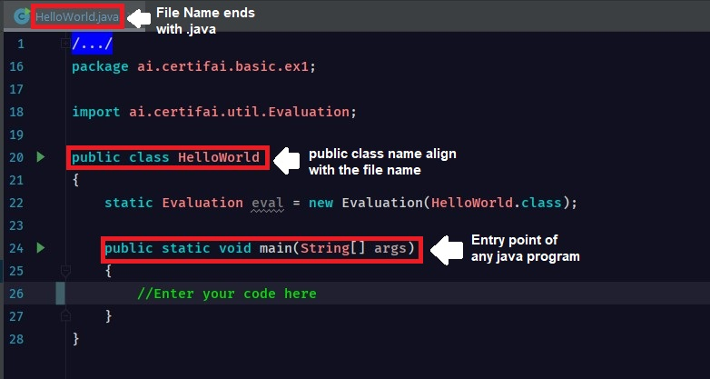

# QuickStart!

**What To Do**  
Pass string of `Hello World!` to the variable [_firstString_](https://github.com/CertifaiAI/java-fundamentals/blob/master/java-core/src/main/java/ai/certifai/basic/ex1/HelloWorld.java#L11)
 

**Sample Output**  
`
Hello World!  
`  

**Key Takeaways**

  

 

- Class name should be in the form of Noun, where each word first letter is of capital letter.  
  This naming convention is **CamelCase**.  
    - Example: 
        - HelloWorld
        - BluePrint
        - DataTypes
        - ExceptionHandling

- There should be one public class name per file

- The class name must be same with file name for Java to recognize the entry point.  
There should be a **public** access modified before it.  
Else will throw a compile time error. (Try it :computer:)

- Contrary to Python, each line should end with semicolon.

**Quiz**  
1. Can more than 1 class appear in one .java file?  

2. What do you understand about the line [_package ai.certifai.basic.ex1;_](https://github.com/CertifaiAI/java-fundamentals/blob/master/java-core/src/main/java/ai/certifai/basic/ex1/HelloWorld.java#L16)?
