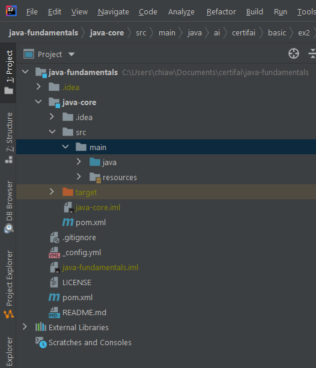
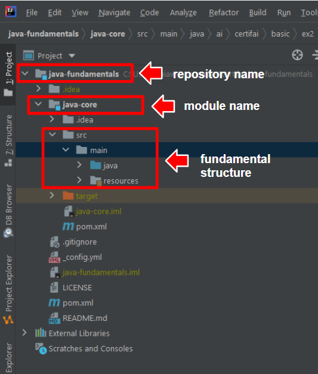
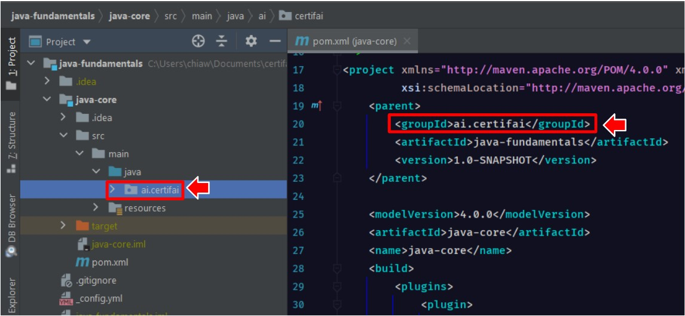
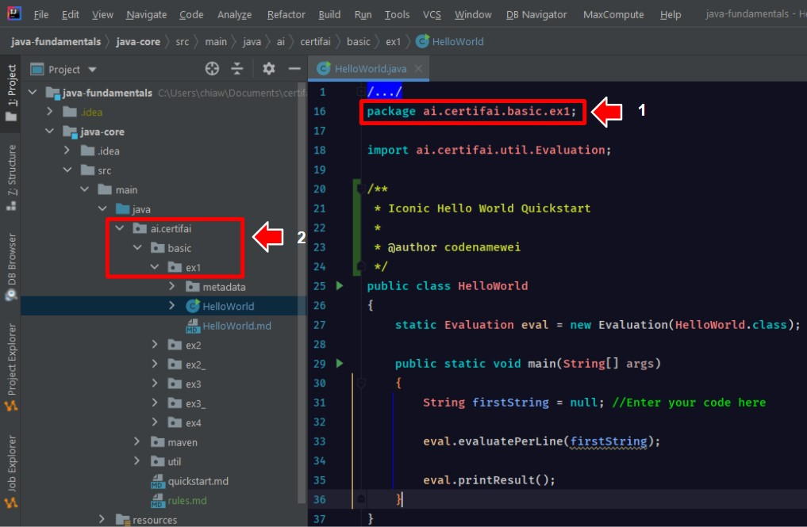

# QuickStart!

**What To Do**  
Pass 'new PackagingIntro().getClass().getCanonicalName();' to the variable [_packageName_](https://github.com/CertifaiAI/java-fundamentals/blob/master/java-core/src/main/java/ai/certifai/basic/ex2/PackagingIntro.java#L31)
 

**Sample Output**  
`
Package Name = ai.certifai.basic.ex2.PackagingIntro 
`  

**Key Takeaways**  
- Basic file directory structure of java project by Apache Maven

  

 

- A few key components to take note of 

  

 

- **Group ID**: Reverse domain name of an organization.  
- Group ID contribute to the beginning of packages name

  

 

- **Packages** group related classes, interfaces, and sub-packages.  
- Packages are defined all in lower case.  
- Packages are period-delimited.    
- Essentially, packages are used to prevent conflicts with file names.  

  

 

**Quiz** 
1. What does the keyword _public_ means?

2. What does the word _static_ means?
