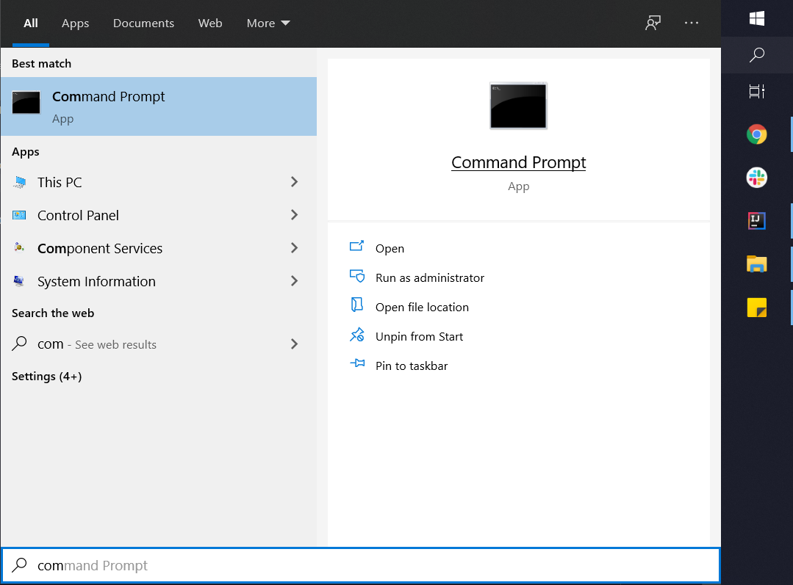
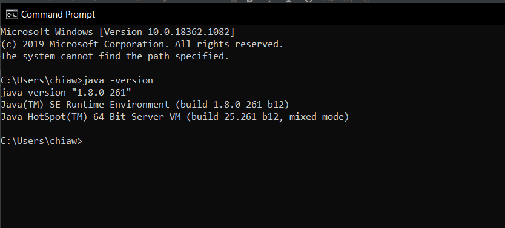
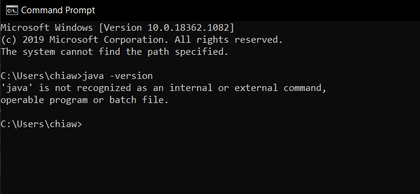
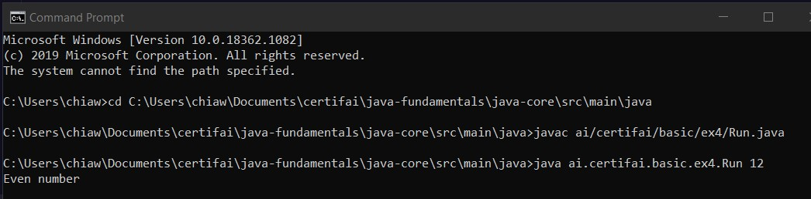
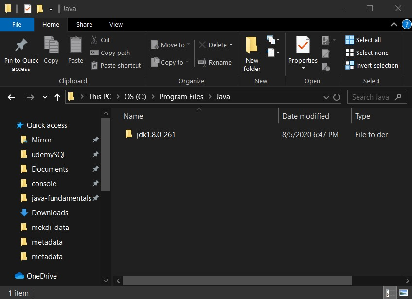
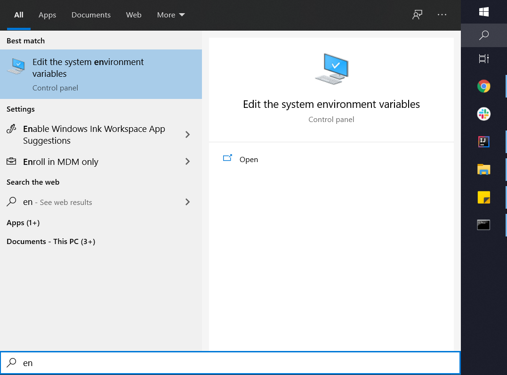
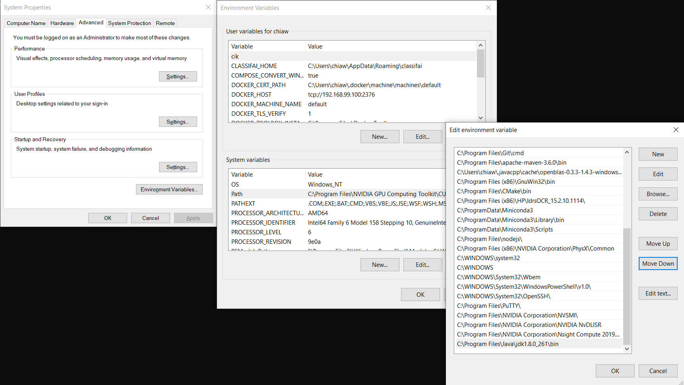

# Java Key Terminologies

**What To Do** 
1. Open up your command prompt / terminal 
 <p align="center">
   
 </p> 

2. Type in java command below
```
java -version
```
If the output is as shown below, proceed to Step 3.
<p align="center">
 
</p> 

If the below happen, go to **Java Environment Path Setup** session at the end of this page.  
<p align="center">
 
</p> 

3. Run the commands below in the command prompt 
Note: {yourpath} is the absolute path to the folder of java-fundamentals
```
cd {yourpath}\java-fundamentals\java-core\src\main\java  
javac ai/certifai/basic/ex4/Run.java
java ai.certifai.basic.ex4.Run 12
```
<p align="center">
 
</p> 

4. Rerun the last command changing the last value between even and odd numbers
```
java ai.certifai.basic.ex4.Run {number}
```

**How To Consider this Exercise Success**  
Able to run step 4 from the previous session


**Key Takeaways**  


**Quiz**  

**Java Environment Path Setup**
1. Find out where is your java program at. Try _C:\Program Files\Java\java*_ or _C:\Program Files\AdoptOpenJDK\java*_.
<p align="center">
 
</p> 

2. Open up **Edit the system environment variables**.  
Add _C:\Program Files\Java\java*\bin_ or  _C:\Program Files\AdoptOpenJDK\java*\bin_ to the PATH variable.

<p align="center">
 
</p>

<p align="center">
 
</p>

