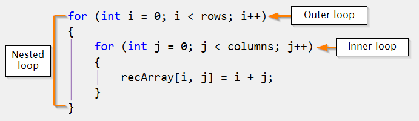

# For Loop
For loop is a very important implementation in most programming.

<p align="center">
 
</p>  

## **What To Do**
Variable [**linesPerUseCase**](https://github.com/CertifaiAI/learn-java-the-certifai-way/blob/master/java-core/src/main/java/ai/certifai/basic/ex7/ForLoop.java#L40) defines how many lines per use case. \
Use a **for loop** to get string input of each line. **Tips: _in.getStringInput()_** \
and get it evaluated by passing to _**out.evaluate(~~)**_.

## **Sample Input**
```
3
hello world
Big screen
Game OfThronews
```

## **Sample Output**
```
hello world
Big screen
Game OfThronews
```

## **Key Takeaways**
- Mastering for-loop is very important for effective use of Java

- Nested for-loop is very common for complex use case.
<p align="center">
 
</p>  
