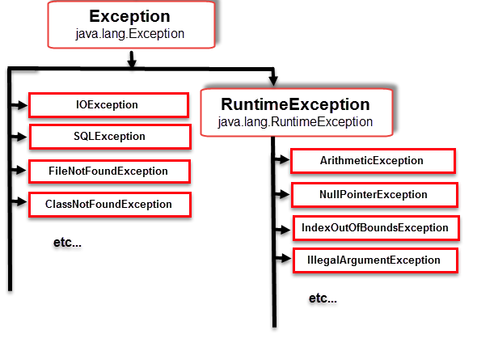

# Exception Handling  

There's two types of errors in general in programming. 
- compile time error
- runtime error (errors and exceptions)

Exception handling in Java is designed to handle the **runtime exceptions**  
so that the normal flow of the application can be maintained.

For example: 
Having code blocks below

```$xslt
public class HelloWorld
{
    public static void main(String args)
    {
        line 1 statement;

        line 2 statement; //RUNTIME ERRORS OCCUR!
        line 3 statement;

        line 4 statement;
        line 5 statement;
        
    }
}
```

<p align="center">
  
</p>  

If exception happens on statement 2, the rest of the code will not be executed.  
Reason being is the scenario will be ill-defined and the results will not be in the range of expectation.  

### try - catch - finally

Exception is written in this way in general. 

```$xslt
try
{
    //statement
}
catch(Exception e)
{
    //statement
}
finally
{
    //statement
}
```
## **What To Do**  

Rewrite the function block
- [_readFile()_]()
- [_divideByZero()_]()
to catch Exception
**Tips:** return e.getClass().getCanonicalName() for each function block for program to successfully execute


## **Sample Input** 

```
int value = 1000 / 0;
```

## **Sample Output** 

```
java.lang.ArithmeticException
```
