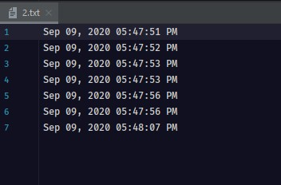

# While Loop

While loop repeatedly executes a target statement as long as a given condition is true.

  

 

## **What To Do**  
This program (specifically BufferedReader) reads in content from specific input file. 
There's no way of knowing how many times to loop through the BufferedReader to get total number of lines beforehand.

A while loop has to be used to iterate through **BufferedReader reader** to get next lines if next line exist.

The function _getTotalNumberOfLines_ takes in a File and return total number of lines of the specific file.

Fill in function [_private static void _getTotalNumberOfLines_(File inputFile) throws Exception_](https://github.com/CertifaiAI/learn-java-the-certifai-way/blob/master/java-core/src/main/java/ai/certifai/intermediate/ex11/WhileLoop.java#L58-L62).

**Tips:** 
- Use **_reader.readLine()_** to read from file
- If there is no next line, **_reader.readLine()_** will return null;
- Change line 63 to return number of lines in the specific file. 

## **Sample Input** 
With input file of 

  

 

## **Sample Output** 
7

## **Above and Beyond** 
- Check out the variant of a while loop - **Do-While loop**

  

 
