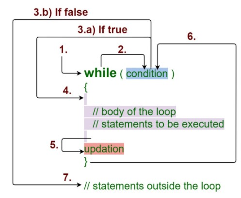
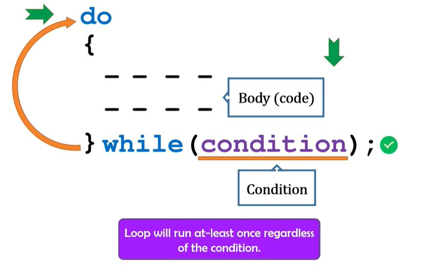

# While Loop

While loop repeatedly executes a target statement as long as a given condition is true.

  

 

## **What To Do**  

Fill in function [_private static void readFile(File inputFile) throws Exception_](https://github.com/CertifaiAI/learn-java-the-certifai-way/blob/master/java-core/src/main/java/ai/certifai/intermediate/ex11/WhileLoop.java#L58-L63).

A while loop has to be used to iterate through **BufferedReader reader** to get next lines if next line exist

**Tips:** 
- Use **_reader.readLine()_** to read from file
- If there is no next line, **_reader.readLine()_** will return null;

## **Sample Input** 
abc\
def

## **Sample Output** 
abc\
def

## **Above and Beyond** 
- Check out the variant of a while loop - **Do-While loop**

  

 
