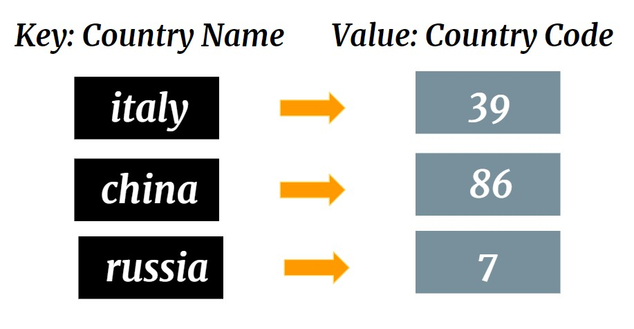
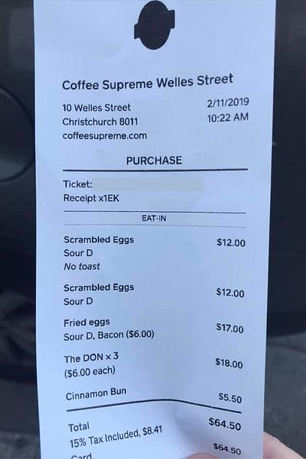
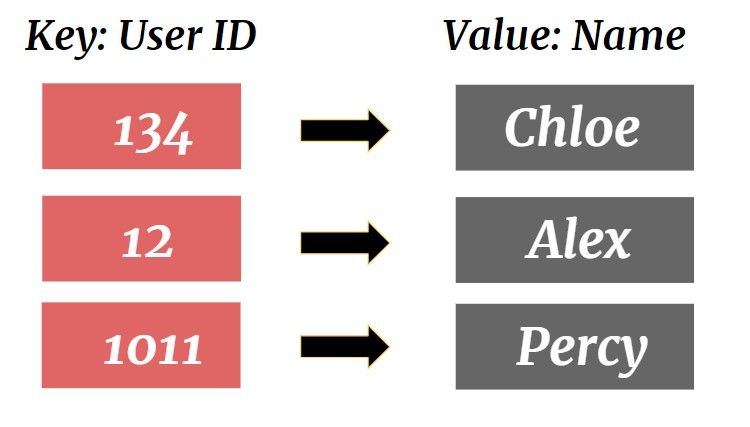

# Map <> HashMap
A Map is an object that maps keys to values.
<p align="center">
 
</p>


In program MapImp, Map<>HashMap is implemented to store country name as key and country code as value.
<p align="center">
 
</p>

**When do we use Map<>HashMap** \
Maps are used for when you want to associate a key with a value and Lists are an ordered collection.

**Example Scenario:** 
- Item names matching with products
<p align="center">
 
</p>

- User IDs matching with names
<p align="center">
 
</p>

## **What To Do**
Given a Map of Country Name and Country Code 

```
Italy: 39
Malaysia: 60
Indonesia: 62
Singapore: 65
China: 86
Russia: 7
```

Input comes in the form of 

- GET country_name
  - If country_name key exist, write **out.evaluate({get the country code})**, else write **out.evaluate("False")** \
  
- DELETE country_name
  - If DELETE an existing key, write **out.evaluate("True")**, else write **out.evaluate("False")** \
   
- ADD country_name country_code 
  - If ADD a key which is not exist in the Map<>HashMap, write **out.evaluate("True")**  and put the key & value exist in **Map keyValue*
  - Else, write **out.evaluate("False")**  

**Only make changes to the function [_configKeyValue(...)_](https://github.com/CertifaiAI/learn-java-the-certifai-way/blob/master/java-core/src/main/java/ai/certifai/intermediate/ex12/MapImp.java#L77-L81)**

## **Sample Input** 
get Malaysia  
delete Malaysia  
delete Malaysia  
add Singapore 65 

## **Sample Output** 
60  
True  
False  
True  

## **Key Takeaways** 

**Properties of Map:**
- Unique Key. There should not be duplicates key.
- Keys should be all belongs to one type of Object. Likewise for values.
    -   Example
        -   Map keyValue = new HashMap<String, String>();
        -   Map countryCode = new HashMap<String, Integer>();
        -   Map method = new HashMap<Integer, Double>();
        
- Not an ordered collection. Does not return keys and values in the same order they have been inserted.


