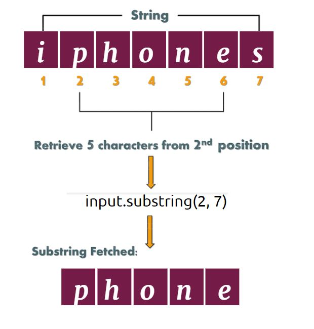

# Manipulation of String

Getting a substring of a string is a very common operation to perform 

 

## **What To Do**  
With each string input, return the file formats if exist

 

### Note:
- Only get the extension name without the dot '.'
- If the corresponding input is a string without file extension format, return **It's not a file!**

Modify the function [_getExtensionIfExist_](https://github.com/CertifaiAI/learn-java-the-certifai-way/blob/master/java-core/src/main/java/ai/certifai/intermediate/ex13/SubString.java#L50-L57) and the returning value of it

## **Sample Input** 
Example.pdf\
SampleFolder

## **Sample Output** 
pdf\
It's not a file!
