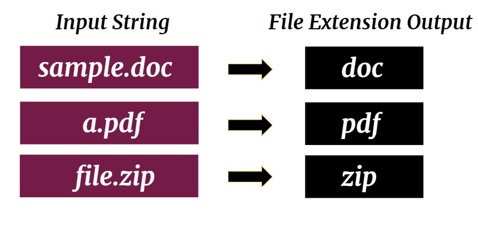

# Manipulation of String

## **What To Do**  
With each string input, return the file formats if exist

 

### Note:
- Only get the extension name without the dot '.'
- If the corresponding input is a string without file extension format, return **It's not a file!**

## **Sample Input** 
Example.pdf\
SampleFolder

## **Sample Output** 
pdf\
It's not a file!
