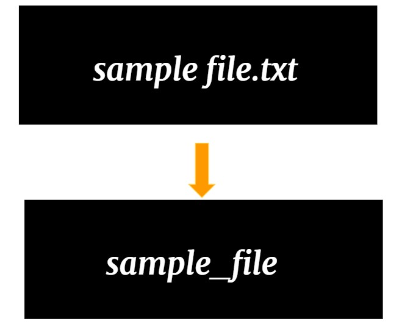

# Advanced Manipulation of String

Lets build on the previous exercises to carry on a more complicated operations for string handling.

## **What To Do**
With each string input, perform the following operations and return the string
- Remove the file extension if any
- Remove the spaces in the beginning and end of string (**Tips:** use string.trim())
- Replace spaces in between letters with underscore (_)

 

Modify function [_processString_](https://github.com/CertifaiAI/learn-java-the-certifai-way/blob/master/java-core/src/main/java/ai/certifai/intermediate/ex14/AdvancedSubString.java#L50-55) and change the returning result in line 55

## **Sample Input**
Example.pdf\
Sample Folder

## **Sample Output**
Example\
Sample_Folder
