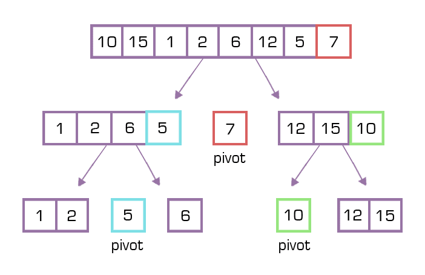

# Quick Sort

Quick sort is a highly efficient sorting algorithm and is based on partitioning of array of data into smaller arrays.

 

The quicksort algorithm choose a pivot point, and partitioning the collection around the pivot, so that elements smaller than the pivot are before it, and elements larger than the pivot are after it

The pivot can be 
- the first element in the array
- the last element in the array
- an element of a random index

## **What To Do**  

Modify class [**_QuickSort_**](https://github.com/CertifaiAI/learn-java-the-certifai-way/blob/master/java-core/src/main/java/ai/certifai/intermediate/ex15/QuickSortImp.java#L24-L36) to perform the quick sort algorithm.  
The returninng **_List_** of the function **_sort_** should be an increasing order array.  
 
## **Sample Input**  
 2 6 3 17 12
 
## **Sample Output**
2 3 6 12 17
