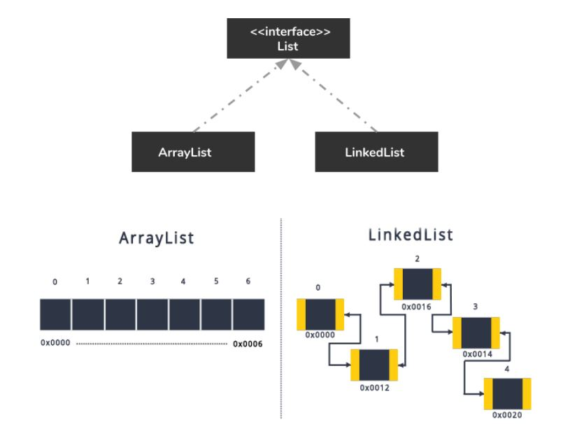
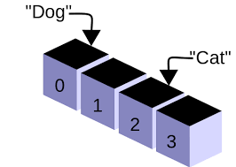

# List<>ArrayList
List interface with ArrayList class create a dynamic array that contains objects.

<p align="center">
 
</p>

In lament terms, a **List<>ArrayList** is a specified container that store values. \
The values in a single container has to be the same type. \
Example:
- an array of integers
- an array of floating values
- an array of string

<p align="center">
 
</p>

## **What To Do**
Iterate over an array of integers given in the function. Modify the _iterate(...)_ function
```
public static void iterate(List<Integer> array)
{
    /**
     Enter your code in this function
     Tips: out.evaluate({content}) has to be used for the program to be success
     **/
}
```
**Tips: Search for _iterate through a java list_ on any web searching browser**


## **Sample Input**
```
1
1 2 3 4 5
```

## **Sample Output**
```
1
2
3
4
5
```

## **Key Takeaways**
- **List<>ArrayList** declaration is compulsory to use Object rather than primitive data types.

| Primitive Data Type | Object |
| --- | ----------- |
| int | Integer |
| double | Double |
| float | Float |
| boolean  | Boolean |

- List<>ArrayList is a dynamic collection of elements. All elements in the same collection have the same types.

## **Above and Beyond**
- How to remove a specified item from an arraylist?

- How to add another arraylist storing the same type of values?

- How to replace a value in a specified index of an arraylist?

- How to get the total sizes of an arraylist?

- What's the differences between arraylist(List<Integer>) and a classic array of values (int[]) ?

