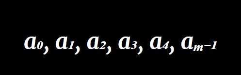
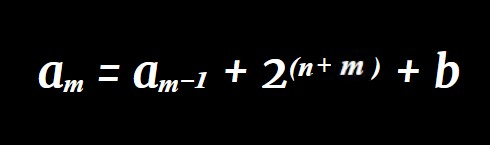
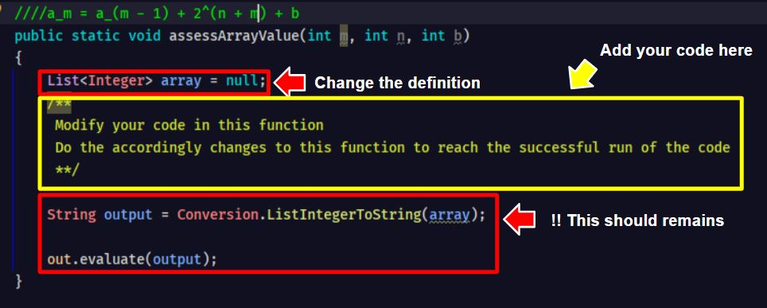

 # Advanced For Loop
Now after you learned about For-Loop and List<>ArrayList. \
Let's combine these two for an interesting challenge.

## **What To Do**

Input text file will be presented in the form below 
- Sample Input File 

For variable **_m, n, b_**, produce output in the form below

   
 
  

Each value _a_ is calculated with the formula of

   
 
  
 
**Note: a0 = 0, always**
 
## **Condition:**
- **_m >= 1_**
- **_n >= 0_**
- **_b >= 0_**

Iterate over an array of integers given in the function. Modify the _assessArrayValue(...)_ function

   
 

## **Sample Input**
2 2 3

## **Sample Output**
7 18

