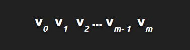
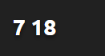

 # Advanced For Loop

**What To Do**
Input text file will be presented in the form below 
- Sample Input File 

For variable **_m, n, b_**, produce output in the form below

   
 
  

For example, 

   
 
  

Each value is calculated with the formula of

   
 
  
 
**Condition:**
- **_m >= 1_**
- **_n >= 0_**
- **_b >= 0_**

**Sample Input**  
2 2 3

**Sample Output**  
7 18

**Key Takeaways**
- implicit casting and explicit casting
