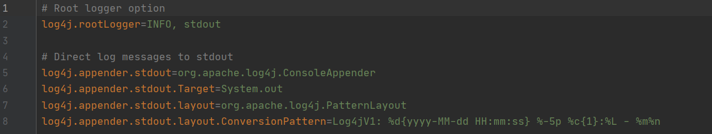

# Configuration of Logging Framework

The logging framework usually have to configure before using. Log4j v1 and v2 could be quickly configured by adding
a log4j(2).properties file in the resources folder whereas for Logback, it could be configured via a XML file or configures itself automatically when no configuration file is found.

In this section we will be explaining on how to configure the logging framework on log4j.properties as the configuration concept 
are nearly the same for the other logging frameworks.

Log4j has three main components:

- Loggers: Provide logging information 

- Appenders: To set where should be the log messages output to (eg: console, file).

- Layouts: To format the log messages according to the configuration.

Below is a sample of a simple configuration of log4j

   
 
 

With image as reference above:
- INFO is the level of logging for the root logger whereas 
stdout is the name that we given for the appender.
- The appender stdout is defined as org.apache.log4j.ConsoleAppender which will
print the log messages to the console.
- The Pattern Layout is where we format the output of our log messages. For detailed
explanation of the log messages, refer [here](https://logging.apache.org/log4j/1.2/apidocs/org/apache/log4j/PatternLayout.html).

####Appender 
There are a lot of appenders available in log4j for user to use:

- FileAppender : 
    - The log messages will save to a file.
- DailyRollingFileAppender : 
    - Extends File Appender where the file rolled over at a chosen time based frequency.
- RollingFileAppender :
    - Extends File Appender where new log file will be created when certain size reached.
- JDBCAppender :
    - Sending the log messages to a database.
- etc..

#### Layout
There are also some other layout available for user to format their messages:
- DateLayout
    - Takes care of all date related formating work.
- HTMLLayout
    - Outputs events in a HTML table.
- XMLLayout
    - Outputs events in a XML file.

