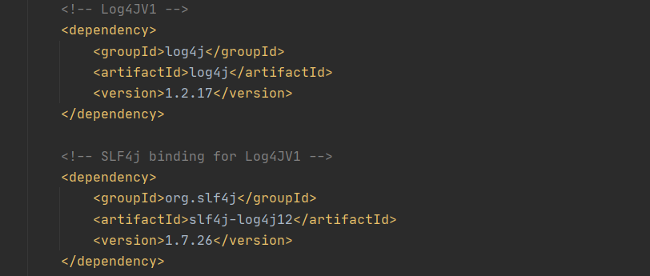

# Java Logging Framework
In this section, we will be mainly focusing on various logging framework with SLF4J bindings as
it serves as a simple facade or abstraction for them. With SLF4J we could easily switch between different framework, 
providing more flexibility in logging messages.

### SLF4J
To use SLF4J, we have to import the required dependencies.

   
 
 

To initialize a logger in a program, just simply import `org.slf4j.Logger` and uses `getLogger` method from the `LoggerFactory`.

   
 
 
 
 
 ### Log4j (V1)
 To use log4j V1 with SLF4J binding, the following dependencies should be imported:
 

    
  
 
  
 With these dependencies, we could have our logger running on log4j framework with SLF4J abstraction.
 
 ### Log4j (V2)
 To use log4j V2 with SLF4J binding, the following dependencies have to be imported:
  

     
   
 
   
  ### Logback
  Since logback natively supports SLF4J, therefore no additional SLF4J bindings are required, just simply import logback dependencies. 
   

      
    
 
