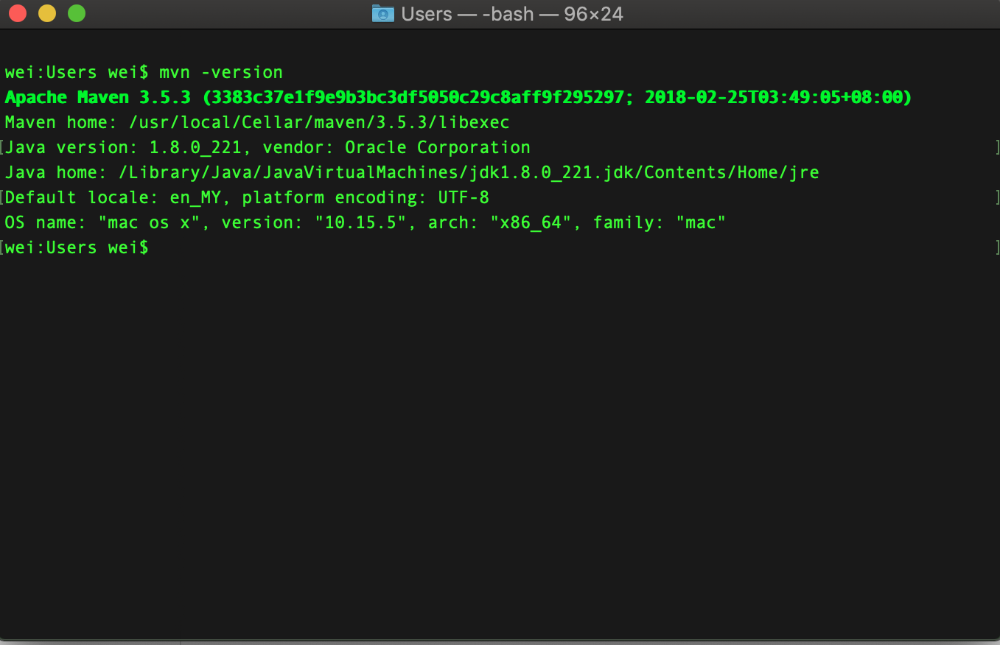
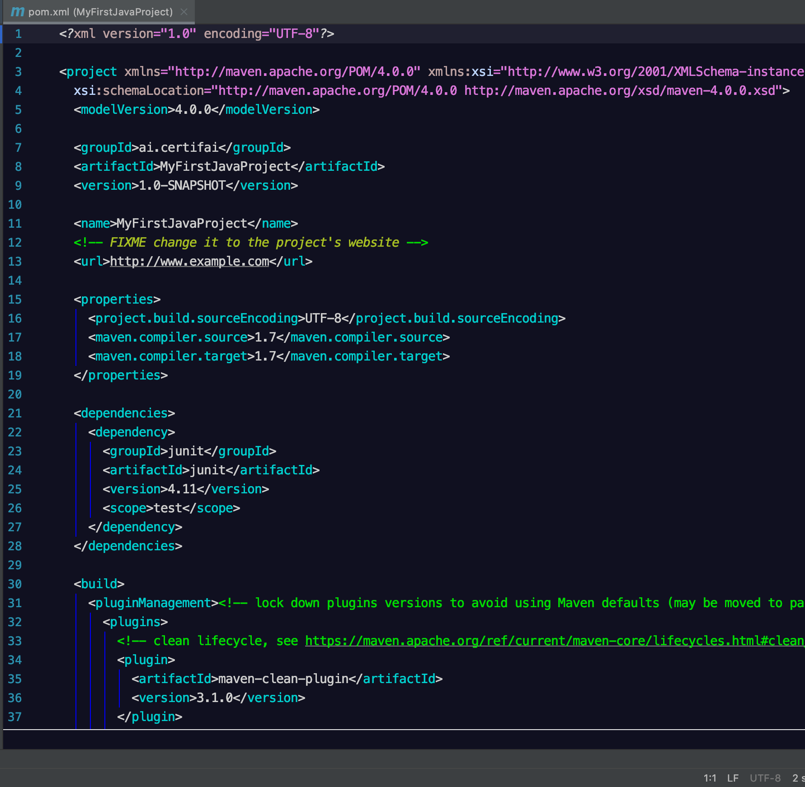
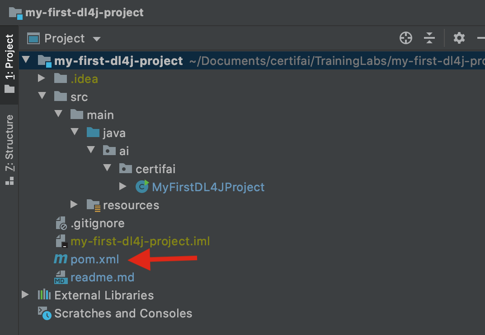
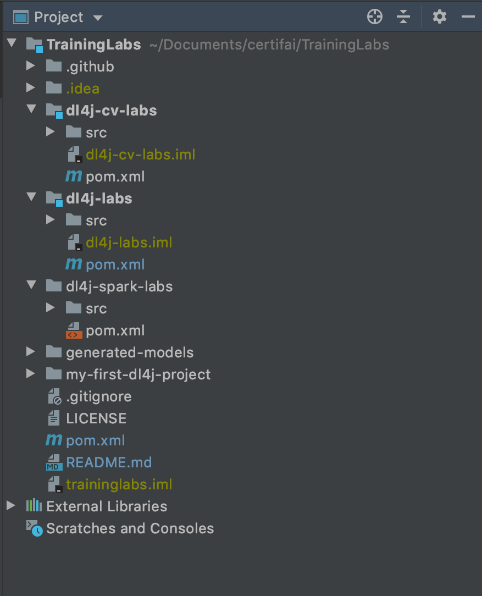

# Gist of Java with Apache Maven

## Chapter 1 Introduction of Apache Maven

### 1.1 Installation of Apache Maven 

- Download and install Apache Maven from [here](https://maven.apache.org/download.cgi).  

- Verify the installation through 
```
mvn -version
```
<p align="center">
  
</p>  

### 1.2 What is Apache Maven

- Apache Maven is a **project management tool** primarily for Java projects. 

- Apache Maven manage a project's build, reporting and documentation from a central piece of information, pom.xml - project object model (POM). 

- This folder covers some of the Maven essentials to manage Java based project in day to day use.

### 1.3 Build an Apache Maven Project :raised_hands: :computer: 


## Chapter 2 Dive in Java with Apache Maven

- The fundamental component to manage dependencies is by using pom.xml - project object model (POM). 
- Simply put, _pom.xml_ is an XML representation of a Maven project with default values of configurations for dependencies name, version and etc.  
- Let's take a look at a bare bone pom.xml.  

<p align="center">
  
</p>  

### Single-Module Java Project

- Note:
  A module in Java represents 
  
- A single-module project 

- With pom.xml, dependency management is easy in defining, creating and maintaining reproducible environments with well-defined classpaths and library versions.

<p align="center">
  
</p>  

### repository and dependency download

- root pom.xml


### group id and name and dependency


### Multi-Modules Project

<p align="center">
  
</p>  


  - root and sub pom.xml
  
### Chapter 3 Useful hacks of Apache Maven with Intellij


### import by pom.xml

### .m2

- what is .m2
- how to find jar files

### invalidate cache and restart

### Reimport project after change of pom.xml


  
