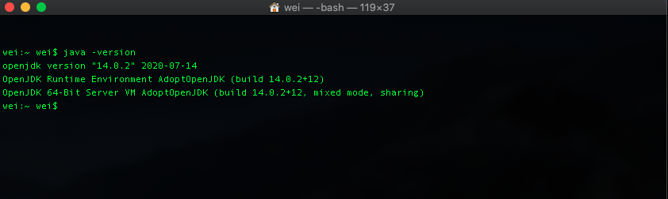

# Brief Introduction of Java

### Why use Java
### (Even though it require more lines of codes and debugging)

There are three keywords to familiarize with in Java Environment. 
- Java Runtime Environment (JVM)
- Java Development Kit (JDK)
- Java Runtime Environment (JRE)

<p align="center">
  
</p> 

**Java Runtime Environment (JVM)**
A Java virtual machine (JVM) is a virtual machine which provides a portable execution environment for Java-based applications.  

There are two variations of Java Installation
- Java Runtime Environment (JRE)
- Java Development Kit (JDK)

**Java Runtime Environment (JRE)**
- Software bundle that allows Java Programs to run 
- Does not provide development environment. 

**Java Development Kit (JDK)**
- The full-featured SDK for Java
- **JDK includes JRE**, but also the compiler (javac) and tools (like javadoc and jdb). Hence capable of creating and compiling programs.

Note:  
The JRE is smaller than the JDK with the lack of development tools as it require less disk spaces.

### Java Development Timeline
<p align="center">
  
</p> 

Java 8 is released on 2014

### Installation of Java :man_technologist: :woman_technologist:

Java can be installed from two sources mainly.
- [Oracle Java](https://www.oracle.com/java/technologies/javase-downloads.html)
- [OpenJDK](https://adoptopenjdk.net/installation.html?variant=openjdk8&jvmVariant=hotspot)

Check if Java is installed fine on your system :man_technologist: :woman_technologist:
```$xslt
java -version
```

<p align="center">
  
</p> 